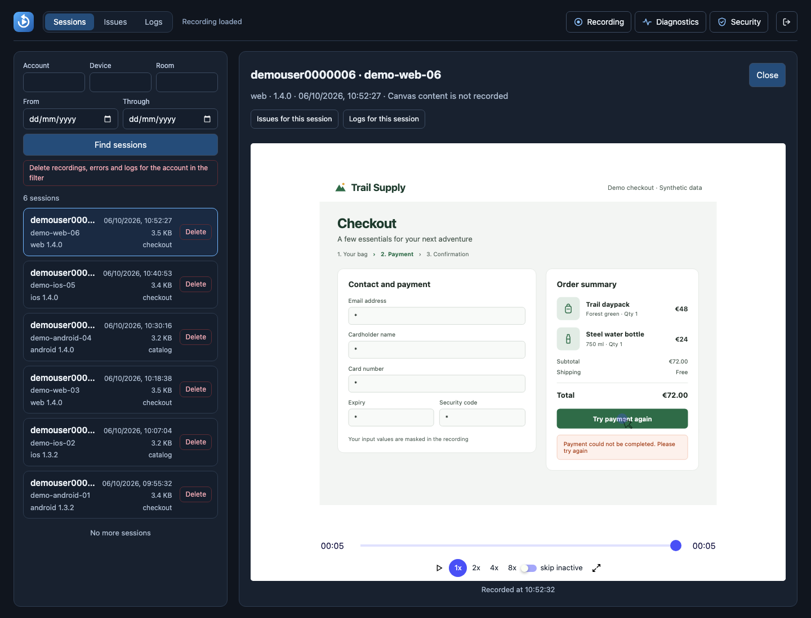
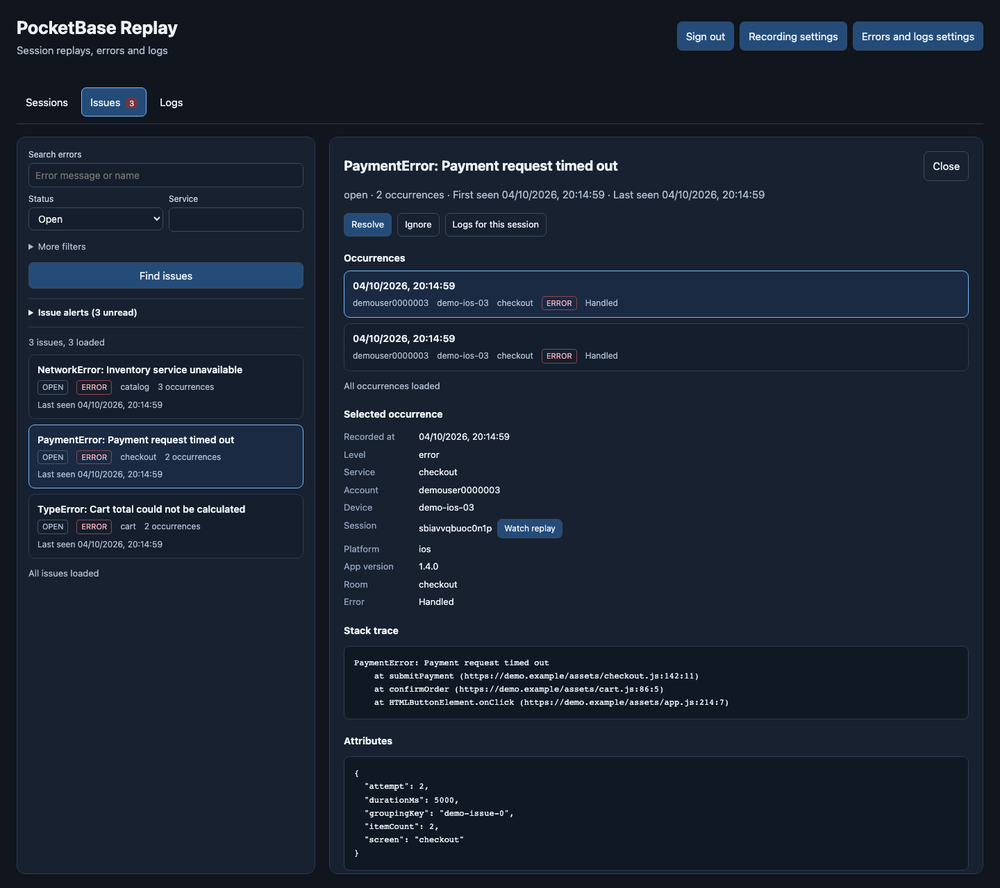
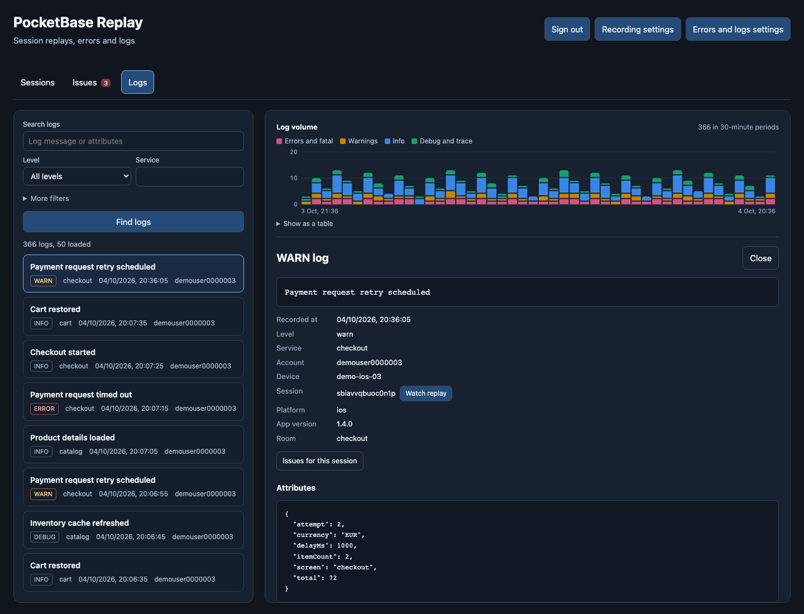
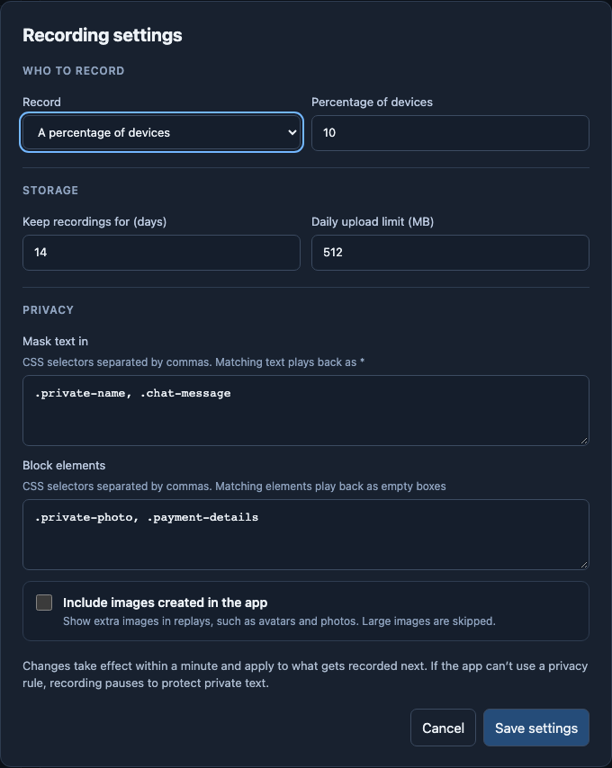

# PocketBase Replay

Self-hosted DOM session replay, error tracking and logs for PocketBase, with
an rrweb recorder and a private dashboard

## Features

- Add replay to an existing PocketBase or run a dedicated replay server
- Use a framework-independent client in web and Electron apps, with a
  [Capacitor plugin](plugins/capacitor/README.md) for Android and iOS
- Select sessions with percentage sampling or verified account allowlists
- Control masking, retention and storage limits from the dashboard
- Find recordings by account, device, date or room and play them with timeline,
  speed and pause controls
- Capture exceptions, group repeated errors into issues, and resolve or ignore
  issues, with alerts in the dashboard and to a Slack, Discord or other webhook
  when an issue appears or returns
- Ingest structured logs, search by message, severity, service, account,
  device or recording, and chart their volume by level over time
- Configure errors and logs independently, with their own retention and a
  shared daily storage limit
- Optionally require revocable ingestion keys, verified accounts, or both

Recording, error tracking and logs are off by default. Dashboard access
requires a PocketBase superuser

Ingestion requirements default off. Open **Upload security** to create
keys and enable **Require API key** or **Require a signed-in account**. Client
keys allow submission only and are public; data access remains private. See
[ingestion security](docs/authentication.md#optional-ingestion-requirements)

Expand **Rate limits** in **Upload security** to adjust replay and error/log
traffic separately. Limits apply even when the key and account requirements
are off. **Save limits** applies changes; **Use default limits** fills the
form for review before saving. See [rate limits](docs/configuration.md#rate-limits)

## Self-hosting comparison

PocketBase Replay runs in one PocketBase process with SQLite; Docker is optional

**Our figures are measured process usage; competitors' figures are published
server requirements**. Feature scope and traffic capacity differ

| Project | CPU | RAM | Storage |
| --- | --- | --- | --- |
| **PocketBase Replay** | 8.3% of one core average | 57.4 MiB sampled peak RSS | Depends on recordings and retention |
| [PostHog](https://posthog.com/docs/self-host) | 4 vCPU | 16 GB | More than 30 GB |
| [OpenReplay](https://docs.openreplay.com/en/deployment/deploy-ubuntu/) | 2 vCPU minimum | 8 GB minimum | 50 GB minimum |
| [Sentry](https://develop.sentry.dev/self-hosted/) | 4 cores minimum | 16 GB RAM + 16 GB swap minimum; 32 GB RAM recommended | 20 GB free minimum |

PostHog's figures cover its unsupported hobby deployment. OpenReplay's cover
low/moderate traffic on x86. Sentry's cover a deployment with Session Replay

| Project | Features | Backend |
| --- | --- | --- |
| **PocketBase Replay** | DOM replay, JavaScript errors, logs and alerts | [One PocketBase process with SQLite](docs/installation.md) |
| **PostHog** | [Replay, product analytics, flags and experiments](https://posthog.com/docs) | [PostgreSQL, ClickHouse, Redpanda, cache and object storage](https://github.com/PostHog/posthog/blob/master/docker-compose.hobby.yml) |
| **OpenReplay** | [Replay, analytics and co-browsing](https://github.com/openreplay/openreplay) | [PostgreSQL, ClickHouse, cache and object storage](https://github.com/openreplay/openreplay/blob/main/scripts/docker-compose/docker-compose.yaml) |
| **Sentry** | [Errors, replay, tracing, profiling and logs](https://github.com/getsentry/self-hosted/blob/26.9.0/sentry/sentry.conf.example.py) | [PostgreSQL, ClickHouse, Kafka, caches and object storage](https://github.com/getsentry/self-hosted/blob/26.9.0/docker-compose.yml) |

Local test: PocketBase 0.39.9 on an 8-core Apple M1 Pro with 16 GiB RAM,
20 synthetic devices, 5 uploads/second for 30 seconds. All 150 uploads were
accepted: 50 replay chunks, 50 errors and 500 log entries

[Benchmark report](docs/benchmarks/2026-10-04-pocketbase-replay.json) ·
[Raw samples](docs/benchmarks/2026-10-04-pocketbase-replay.csv) ·
[Reproduction script](scripts/benchmark-server.mjs)

## Dashboard

Open `/dash/replay` on your PocketBase server to browse recordings, investigate
errors and search logs. These screenshots show the dashboard running locally
with synthetic demo data

### Session replay

Find sessions by account, device, room or date, then watch the recording with
timeline, speed and pause controls. Open the session's related issues and logs
from the player



### Errors and issues

Repeated errors are grouped into issues. Inspect occurrences, stack traces and
device context, jump to the linked replay, and resolve or ignore an issue.
Alerts flag new issues and failures that return after being resolved



### Structured logs

Search messages and filter by severity, service, account, device or session.
The volume chart shows activity by log level; each entry includes its context,
structured attributes and a replay link when available



<details>
<summary>Recording settings and privacy controls</summary>

Choose percentage sampling or selected accounts, set retention and upload
limits, and configure text masking and blocked elements. Errors and logs have
separate collection and retention controls in Errors and logs settings, which
also controls issue alerts



</details>

## Platform plugins

**Capacitor is available in this repository.** The
[`capacitor-pocketbase-replay`](plugins/capacitor/README.md) plugin adds Android
and iOS app lifecycle handling and native HTTP transport to the core client.
It records the WebView DOM and captures JavaScript errors and application logs,
pausing and resuming when the app's native state changes

| Platform | Status | Integration |
| --- | --- | --- |
| [Capacitor](plugins/capacitor/README.md) | Implemented | Android, iOS and web; session replay, JavaScript errors and logs |
| React Native | Future integration | No plugin implemented yet |
| NativeScript | Future integration | No plugin implemented yet |
| Flutter | Future integration | No plugin implemented yet |

Plugins ship as separate packages. Native interfaces need a platform-specific
recorder; the current recorder captures browser and WebView DOM. See the
[platform plugin guide](plugins/README.md) for the architecture and how to add
an integration

## Get started

### 1. Install the client

In your frontend project:

```sh
npm install pocketbase-replay
```

Build a package from a checkout of this repository:

```sh
npm ci
npm pack
```

In your frontend project, install the generated tarball using the filename
printed by `npm pack`:

```sh
npm install /path/to/pocketbase-replay-VERSION.tgz
```

The client works with bundlers such as Vite, and TypeScript is optional

### 2. Set up PocketBase

Choose an [existing PocketBase](docs/installation.md#existing-pocketbase) or a
[dedicated replay server with Docker](docs/installation.md#dedicated-replay-database)

Open `/dash/replay` on that server and sign in with a PocketBase superuser

In Recording settings, configure your [privacy rules](docs/configuration.md#privacy-rules)
and enable percentage sampling

### 3. Connect your app

```js
import { startReplay } from 'pocketbase-replay';

const replay = startReplay({
  endpoint: 'https://replay.example.com',
  metadata: () => ({
    deviceId: yourApp.deviceId,
    platform: 'web',
    appVersion: '1.0.0',
  }),
});

// When the app is disposed
replay.stop();
```

Use your app's stable device ID and deployed server URL, then watch a new
recording in the dashboard to check playback and masking

If you enable **Require API key**, pass the dashboard's key as `apiKey` to
`startReplay` and `startObservability`. Update all senders before enabling the
requirement. **Require a signed-in account** separately requires verified
`accountId` and `authToken` metadata

See [client integration](docs/integration.md) for accounts, room metadata,
lifecycle handling and native asset setup

In a Capacitor app, the [Capacitor plugin](plugins/capacitor/README.md) wraps
this client and adds native pause and resume

### 4. Add errors and logs

In `/dash/replay`, open Errors and logs settings and enable the features you need

```js
import { startObservability } from 'pocketbase-replay';

const diagnostics = startObservability({
  endpoint: 'https://replay.example.com',
  metadata: () => ({
    deviceId: yourApp.deviceId,
    platform: 'web',
    appVersion: '1.0.0',
  }),
  errors: { captureUnhandled: true },
  logs: { captureConsole: ['warn', 'error'] },
  service: 'frontend',
  replay,
});

diagnostics.captureException(new Error('Checkout failed'));
diagnostics.captureLog('info', 'Checkout started', { cartItems: 3 });
```

Each feature needs to be enabled both in the client and on the server. Errors
and logs also work when replay recording is off or no recorder is supplied

See [errors and logs](docs/observability.md) for configuration, manual capture,
privacy, alert behavior and the ingestion API

## Privacy and compatibility

- Input values and editable text are masked by default
- Text outside inputs needs masking or blocking rules for your app
- Canvas, WebGL, iframes, video and audio are not captured
- DOM replay needs available images, fonts and other page assets
- The client requires Chromium 91 or newer

Use HTTPS for remote deployments and keep superuser tokens out of your frontend

## Documentation

| Guide | Covers |
| --- | --- |
| [Installation](docs/installation.md) | Existing and dedicated servers, upgrades, HTTPS and reverse proxies |
| [Client integration](docs/integration.md) | Metadata, Capacitor, Electron, custom transports and native assets |
| [Configuration](docs/configuration.md) | Sampling, retention, storage budgets, privacy rules and playback |
| [Errors and logs](docs/observability.md) | Capture options, issue resolution, alerts, searchable logs and ingestion |
| [Upload security and accounts](docs/authentication.md) | Optional API keys, verified-account requirements, token verification and account deletion |
| [Privacy and limits](docs/privacy-and-limits.md) | Captured data, retries, recording limits and compatibility |
| [Development](docs/development.md) | Local checks, performance measurement and releases |
| [Platform plugins](plugins/README.md) | Capacitor, future React Native, NativeScript and Flutter integrations, and plugin architecture |

## License

[MIT](LICENSE)
